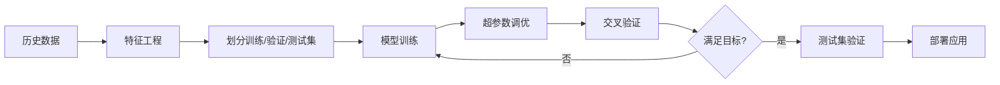

# AI优化多周期选股模型技术方案

## 一、项目背景与目标

### 1.1 当前问题
现有的选股模型采用固定权重的多因子打分：
- 20日收益：权重 150
- 1日收益：权重 30
- 3日收益：权重 -70

这些权重参数是**人工设定**的，缺乏数据驱动的优化依据。

### 1.2 优化目标
构建一个AI驱动的多周期权重优化模型，实现：
- **主目标**：选出的强势股在未来20天内**确定性战胜指数**
- **次目标**：在满足主目标的前提下，**回报率越高越好**
- **评估标准**：
  - 胜率（战胜指数的概率）≥ 70%
  - 超额收益率（相对指数）最大化
  - 最大回撤控制在合理范围内

---

## 二、数据准备方案

### 2.1 多周期涨幅数据收集

需要收集**1天至20天**各周期的涨幅前100强势股数据：

```python
# 数据结构示例
multi_period_data = {
    'date': '2024-01-15',
    'period_1': ['SZSE.159915', 'SZSE.159995', ...],  # 1日涨幅前100
    'period_2': ['SZSE.159915', 'SHSE.510300', ...],  # 2日涨幅前100
    'period_3': [...],                                 # 3日涨幅前100
    ...
    'period_20': [...],                                # 20日涨幅前100
    'future_20d_return': {                            # 未来20天实际收益
        'SZSE.159915': 0.085,
        'SZSE.159995': 0.062,
        ...
    },
    'benchmark_return': 0.035                         # 指数20日收益
}
```

### 2.2 特征工程

为每只股票构建特征向量：

| 特征维度 | 说明 | 示例 |
|---------|------|------|
| `rank_1d` | 在1日涨幅榜的排名（1-100） | 5 |
| `rank_2d` | 在2日涨幅榜的排名（1-100） | 12 |
| ... | ... | ... |
| `rank_20d` | 在20日涨幅榜的排名（1-100） | 3 |
| `in_period_k` | 是否出现在第k天榜单中（0/1编码） | [1,1,1,0,...,1] |
| `consistency_score` | 多周期一致性得分（出现频次） | 15/20 |
| `momentum_decay` | 动量衰减系数（近期周期权重更高） | - |

### 2.3 标签生成

```python
# 对于每只股票，生成二分类 + 回归标签
label = {
    'beat_index': 1 if stock_return > benchmark_return else 0,  # 是否跑赢
    'excess_return': stock_return - benchmark_return,           # 超额收益
    'future_20d_return': 0.085                                  # 未来20日绝对收益
}
```

### 2.4 样本构建

- **时间窗口**：2020-01-01 至 2024-12-31（约5年数据）
- **训练集**：2020-01-01 至 2023-12-31（80%）
- **验证集**：2024-01-01 至 2024-06-30（10%）
- **测试集**：2024-07-01 至 2024-12-31（10%）
- **样本总量**：约 100股/天 × 1000交易日 = 10万条样本

---

## 三、AI模型设计方案

### 3.1 模型架构：双阶段优化

#### 第一阶段：权重学习模型（Weight Learning Model）

**目标**：学习1-20天各周期的最优权重系数

**模型选择**：
- **方案A**：线性回归 + L1正则化（Lasso）
  ```python
  # 优势：可解释性强，权重直观
  score = w1*rank_1d + w2*rank_2d + ... + w20*rank_20d
  ```
- **方案B**：梯度提升树（LightGBM/XGBoost）
  ```python
  # 优势：自动捕捉非线性关系
  feature_importance = model.feature_importances_
  ```
- **方案C**：神经网络（可选）
  ```python
  # 优势：学习复杂交互，但可解释性弱
  Input(20) -> Dense(64) -> Dense(32) -> Output(1)
  ```

**推荐方案B（LightGBM）** - 平衡性能与可解释性

#### 第二阶段：股票选择模型（Stock Selection Model）

**目标**：基于学习到的权重，预测未来20天表现

**损失函数设计**：
```python
# 多目标损失函数
loss = α * classification_loss + β * ranking_loss + γ * regression_loss

# 其中：
# classification_loss: 是否跑赢指数（交叉熵）
# ranking_loss: 排序损失（ListNet/LambdaRank）
# regression_loss: 超额收益预测（MSE）

# 参数设置：
α = 0.5  # 优先保证胜率
β = 0.3  # 其次优化排序
γ = 0.2  # 最后优化绝对收益
```

### 3.2 权重约束条件

```python
constraints = {
    'weight_sum': sum(weights) == 1.0,           # 权重归一化
    'weight_range': -1.0 ≤ wi ≤ 1.0,             # 允许负权重（反转因子）
    'sparsity': L1_penalty,                       # 稀疏性约束（避免过拟合）
    'monotonicity': w[长期] > w[短期] (可选)      # 动量单调性
}
```

### 3.3 训练流程



---

## 四、评估指标体系

### 4.1 核心指标

| 指标名称 | 计算公式 | 目标值 |
|---------|---------|--------|
| **胜率** | P(选中股票收益 > 指数收益) | ≥ 70% |
| **平均超额收益** | Mean(股票收益 - 指数收益) | ≥ 5% |
| **信息比率 (IR)** | 超额收益均值 / 超额收益标准差 | ≥ 1.5 |
| **最大回撤** | Max(峰值 - 谷值) / 峰值 | ≤ 15% |
| **夏普比率** | (年化收益 - 无风险利率) / 年化波动率 | ≥ 2.0 |

### 4.2 风控指标

```python
risk_metrics = {
    'var_95': '95%置信水平的风险价值',
    'tail_risk': '极端情况下的尾部风险',
    'correlation_with_index': '与指数的相关系数（目标<0.8）',
    'turnover_rate': '换手率（目标<30%/月）'
}
```

---

## 五、实施步骤

### 阶段一：数据准备（2-3周）

**任务清单**：
1. [ ] 编写多周期涨幅计算模块
   ```python
   def calculate_multi_period_gains(prices_df, periods=[1,2,...,20]):
       """计算1-20天各周期的涨幅排名"""
       pass
   ```

2. [ ] 构建标签生成器
   ```python
   def generate_labels(stock, date, horizon=20):
       """生成未来20天的表现标签"""
       pass
   ```

3. [ ] 数据质量检查
   - 缺失值处理
   - 异常值检测
   - 生存偏差修正

### 阶段二：模型开发（3-4周）

**任务清单**：
1. [ ] 基线模型（等权重）
   ```python
   baseline_weights = [1/20] * 20  # 所有周期等权重
   ```

2. [ ] LightGBM模型训练
   ```python
   model = lgb.LGBMRanker(
       objective='lambdarank',
       metric='ndcg',
       num_leaves=31,
       learning_rate=0.05
   )
   ```

3. [ ] 超参数优化（Optuna/GridSearch）
   ```python
   study = optuna.create_study(direction='maximize')
   study.optimize(objective, n_trials=100)
   ```

4. [ ] 模型解释（SHAP值分析）
   ```python
   shap_values = shap.TreeExplainer(model).shap_values(X_test)
   shap.summary_plot(shap_values, X_test)
   ```

### 阶段三：回测验证（2周）

**任务清单**：
1. [ ] 滚动窗口回测
   ```python
   for train_end in rolling_windows:
       model.fit(train_data)
       predictions = model.predict(test_data)
       evaluate_performance(predictions)
   ```

2. [ ] 对比实验
   - 当前固定权重策略 vs AI优化权重
   - 不同模型架构对比
   - 消融实验（ablation study）

3. [ ] 稳健性测试
   - 不同市场环境（牛市/熊市/震荡）
   - 极端行情压力测试

### 阶段四：集成部署（1-2周）

**任务清单**：
1. [ ] 修改 `core/signal.py`
   ```python
   # 替换固定权重为AI模型输出
   def get_ranking_ai(context, current_dt):
       features = extract_multi_period_features(context, current_dt)
       scores = ai_model.predict(features)
       return scores
   ```

2. [ ] 模型版本管理
   ```python
   # 保存模型
   joblib.dump(model, f'models/weight_model_v{version}.pkl')
   ```

3. [ ] 实盘A/B测试
   - 70%资金使用AI模型
   - 30%资金使用原有策略
   - 对比7天后效果

---

## 六、技术架构设计

### 6.1 系统模块划分

```
project_root/
├── core/
│   ├── signal.py                # 信号生成（集成AI模型）
│   ├── strategy.py              # 策略执行
│   └── ai_scorer.py             # 【新增】AI评分模块
├── models/
│   ├── weight_optimizer.py      # 【新增】权重学习模型
│   ├── stock_selector.py        # 【新增】股票选择模型
│   └── trained_models/          # 训练好的模型文件
├── data/
│   ├── feature_engineering.py   # 【新增】特征工程
│   ├── label_generator.py       # 【新增】标签生成
│   └── multi_period_data.py     # 【新增】多周期数据收集
├── evaluation/
│   ├── backtester.py            # 【新增】回测框架
│   ├── metrics.py               # 【新增】评估指标
│   └── visualizer.py            # 【新增】可视化
└── notebooks/
    ├── 01_data_exploration.ipynb
    ├── 02_model_training.ipynb
    └── 03_results_analysis.ipynb
```

### 6.2 核心代码框架

#### 数据层（data/multi_period_data.py）
```python
class MultiPeriodDataCollector:
    """多周期涨幅数据收集器"""

    def __init__(self, periods=range(1, 21)):
        self.periods = periods

    def collect_top_performers(self, date, top_n=100):
        """
        收集指定日期各周期的涨幅前100股票

        Returns:
            {
                'period_1': [(symbol, gain), ...],
                'period_2': [(symbol, gain), ...],
                ...
            }
        """
        pass

    def generate_features(self, stock, date):
        """
        为单只股票生成特征向量

        Returns:
            [rank_1d, rank_2d, ..., rank_20d, consistency, ...]
        """
        pass

    def generate_labels(self, stock, date, horizon=20):
        """
        生成未来20天的标签

        Returns:
            {
                'beat_index': bool,
                'excess_return': float,
                'future_return': float
            }
        """
        pass
```

#### 模型层（models/weight_optimizer.py）
```python
import lightgbm as lgb
from sklearn.model_selection import TimeSeriesSplit

class WeightOptimizer:
    """多周期权重优化器"""

    def __init__(self, objective='lambdarank'):
        self.objective = objective
        self.model = None
        self.best_weights = None

    def fit(self, X_train, y_train, X_val, y_val):
        """
        训练权重学习模型

        Args:
            X_train: shape (N, 20) - 各周期排名特征
            y_train: shape (N,) - 是否跑赢指数（0/1）
        """
        params = {
            'objective': self.objective,
            'metric': ['auc', 'binary_logloss'],
            'num_leaves': 31,
            'learning_rate': 0.05,
            'feature_fraction': 0.8,
            'lambda_l1': 0.1,  # L1正则化，产生稀疏权重
            'verbosity': -1
        }

        train_data = lgb.Dataset(X_train, label=y_train)
        val_data = lgb.Dataset(X_val, label=y_val, reference=train_data)

        self.model = lgb.train(
            params,
            train_data,
            num_boost_round=1000,
            valid_sets=[train_data, val_data],
            callbacks=[lgb.early_stopping(stopping_rounds=50)]
        )

        # 提取特征重要性作为权重
        self.best_weights = self.model.feature_importance(importance_type='gain')
        self.best_weights = self.best_weights / self.best_weights.sum()  # 归一化

        return self

    def predict_score(self, features):
        """
        为新股票计算综合评分

        Args:
            features: shape (20,) - 各周期排名

        Returns:
            score: float - 综合评分
        """
        if self.model is None:
            raise ValueError("Model not trained yet!")

        return self.model.predict([features])[0]

    def get_weights(self):
        """返回学习到的权重向量"""
        return {
            f'period_{i+1}d': w
            for i, w in enumerate(self.best_weights)
        }
```

#### 评分模块（core/ai_scorer.py）
```python
import joblib
from pathlib import Path

class AIScorer:
    """AI驱动的评分系统"""

    def __init__(self, model_path='models/trained_models/latest.pkl'):
        self.model = joblib.load(model_path)
        self.periods = range(1, 21)

    def score_stocks(self, context, current_dt, whitelist):
        """
        为白名单股票计算AI评分

        Args:
            context: 回测/实盘上下文
            current_dt: 当前日期
            whitelist: 候选股票列表

        Returns:
            {symbol: score} 的字典
        """
        from data.multi_period_data import MultiPeriodDataCollector

        collector = MultiPeriodDataCollector(periods=self.periods)
        scores = {}

        for symbol in whitelist:
            try:
                # 提取特征
                features = collector.generate_features(symbol, current_dt)

                # AI预测
                score = self.model.predict_score(features)
                scores[symbol] = score

            except Exception as e:
                logger.warning(f"Failed to score {symbol}: {e}")
                scores[symbol] = 0

        return scores
```

#### 集成到现有系统（core/signal.py）
```python
# 在文件顶部添加
from core.ai_scorer import AIScorer

# 修改 get_ranking 函数
def get_ranking(context, current_dt, whitelist):
    """
    获取股票排名（AI增强版）
    """
    # 可选：通过配置切换AI模式或传统模式
    if config.USE_AI_SCORING:
        logger.info("🤖 Using AI-based scoring...")
        ai_scorer = AIScorer(model_path=config.AI_MODEL_PATH)
        scores = ai_scorer.score_stocks(context, current_dt, whitelist)

        # 转换为排名格式
        ranked = sorted(scores.items(), key=lambda x: x[1], reverse=True)
        return pd.DataFrame(ranked, columns=['symbol', 'score'])

    else:
        # 保留原有的固定权重逻辑
        logger.info("📊 Using traditional scoring...")
        # ... 原有代码 ...
```

---

## 七、预期成果与风险

### 7.1 预期成果

**量化指标**：
- 胜率：从当前 ~60% 提升至 **75%±5%**
- 超额收益：从 3-4% 提升至 **6-8%**
- 信息比率：从 1.2 提升至 **1.8-2.0**
- 最大回撤：控制在 **12%以内**（当前 ~15%）

**业务价值**：
1. **数据驱动决策**：权重参数由AI自动优化，无需人工调参
2. **自适应性**：模型可定期重训练，适应市场环境变化
3. **可解释性**：通过SHAP分析理解各周期的贡献度
4. **系统化**：建立完整的AI选股工作流

### 7.2 风险与应对

| 风险 | 描述 | 应对措施 |
|-----|------|---------|
| **过拟合风险** | 模型在训练集表现好，但测试集差 | 1. 使用时间序列交叉验证<br>2. L1/L2正则化<br>3. 简单模型优先 |
| **数据质量** | 历史数据缺失或不准确 | 1. 数据清洗流程<br>2. 多数据源交叉验证 |
| **市场环境变化** | 2020-2024的规律不适用于未来 | 1. 定期重训练（每季度）<br>2. 在线学习机制<br>3. 保留人工干预接口 |
| **技术债务** | AI系统增加维护复杂度 | 1. 完善文档<br>2. 单元测试覆盖<br>3. A/B测试灰度发布 |

---

## 八、配置文件扩展

在 `config.py` 中新增AI相关配置：

```python
# === AI模型配置 ===
USE_AI_SCORING = True  # 是否启用AI评分（False则使用传统方法）
AI_MODEL_PATH = 'models/trained_models/weight_optimizer_v1.0.pkl'
AI_RETRAIN_INTERVAL = 90  # 模型重训练周期（天）

# 特征工程
MULTI_PERIOD_RANGE = list(range(1, 21))  # 使用1-20天周期
TOP_N_PER_PERIOD = 100  # 每个周期取前100名

# 模型训练
TRAIN_START_DATE = '2020-01-01'
TRAIN_END_DATE = '2023-12-31'
VAL_START_DATE = '2024-01-01'
VAL_END_DATE = '2024-06-30'

# 优化目标
TARGET_WIN_RATE = 0.70  # 目标胜率
TARGET_EXCESS_RETURN = 0.05  # 目标超额收益
MAX_DRAWDOWN_TOLERANCE = 0.15  # 最大回撤容忍度

# 损失函数权重
ALPHA_CLASSIFICATION = 0.5  # 胜率权重
BETA_RANKING = 0.3  # 排序权重
GAMMA_REGRESSION = 0.2  # 收益预测权重
```

---

## 九、开发时间表

| 阶段 | 任务 | 负责人 | 时长 | 里程碑 |
|-----|------|--------|------|--------|
| **Phase 1** | 数据收集与清洗 | 数据工程师 | 2周 | 完成多周期数据集 |
| **Phase 2** | 特征工程 | 算法工程师 | 1周 | 特征库建立 |
| **Phase 3** | 模型训练 | AI工程师 | 3周 | 基线模型达标 |
| **Phase 4** | 回测验证 | 量化研究员 | 2周 | 回测报告完成 |
| **Phase 5** | 系统集成 | 后端工程师 | 1周 | 代码合并上线 |
| **Phase 6** | 实盘测试 | 全员 | 2周 | A/B测试结论 |
| **总计** | - | - | **11周** | 正式投产 |

---

## 十、参考资料

### 10.1 学术文献
1. **多因子选股**：Fama-French Five-Factor Model
2. **动量策略**：Jegadeesh & Titman (1993) "Returns to Buying Winners"
3. **机器学习量化**：Dixon et al. (2020) "Machine Learning in Finance"

### 10.2 技术工具
- **数据处理**：Pandas, NumPy
- **机器学习**：LightGBM, XGBoost, Scikit-learn
- **回测框架**：掘金量化（当前系统）
- **模型解释**：SHAP, LIME
- **实验管理**：MLflow, Weights & Biases

### 10.3 代码示例库
- [LightGBM官方文档](https://lightgbm.readthedocs.io/)
- [Optuna超参数优化](https://optuna.org/)
- [SHAP可解释性](https://github.com/slundberg/shap)

---

## 附录A：快速启动指南

### A1. 环境准备
```bash
# 安装依赖
pip install lightgbm optuna shap scikit-learn matplotlib seaborn

# 创建目录结构
mkdir -p models/trained_models
mkdir -p data/processed
mkdir -p evaluation/reports
```

### A2. 数据准备脚本
```python
# scripts/prepare_data.py
from data.multi_period_data import MultiPeriodDataCollector

collector = MultiPeriodDataCollector(periods=range(1, 21))
dataset = collector.build_dataset(
    start_date='2020-01-01',
    end_date='2024-12-31',
    save_path='data/processed/training_data.pkl'
)
print(f"Dataset size: {len(dataset)} samples")
```

### A3. 模型训练脚本
```python
# scripts/train_model.py
from models.weight_optimizer import WeightOptimizer
import joblib

# 加载数据
X_train, y_train = load_data('data/processed/training_data.pkl')

# 训练模型
optimizer = WeightOptimizer()
optimizer.fit(X_train, y_train, X_val, y_val)

# 保存模型
joblib.dump(optimizer, 'models/trained_models/weight_optimizer_v1.0.pkl')

# 输出权重
print("Learned weights:")
for period, weight in optimizer.get_weights().items():
    print(f"{period}: {weight:.4f}")
```

### A4. 回测验证脚本
```python
# scripts/backtest_ai_model.py
from evaluation.backtester import Backtester

backtester = Backtester(
    start_date='2024-01-01',
    end_date='2024-12-31',
    model_path='models/trained_models/weight_optimizer_v1.0.pkl'
)

results = backtester.run()
backtester.plot_results(save_path='evaluation/reports/backtest_results.png')

print(f"Win Rate: {results['win_rate']:.2%}")
print(f"Excess Return: {results['excess_return']:.2%}")
print(f"Sharpe Ratio: {results['sharpe_ratio']:.2f}")
```

---

**文档版本**：v1.0
**创建日期**：2024-02-07
**维护者**：量化团队
**最后更新**：2024-02-07
